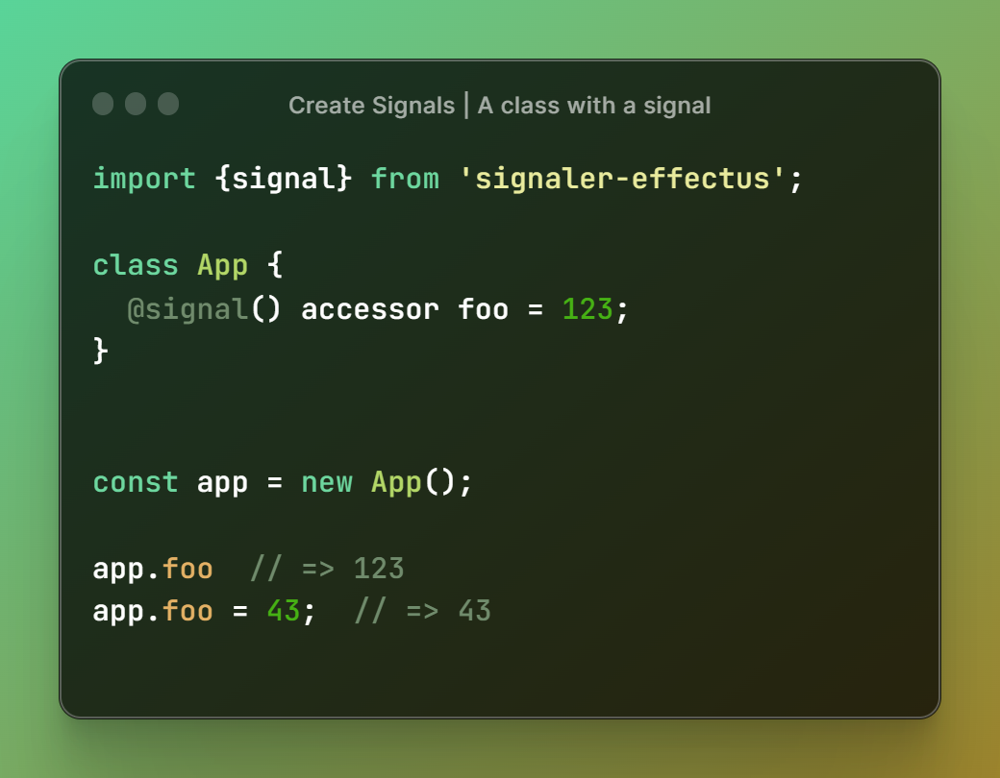
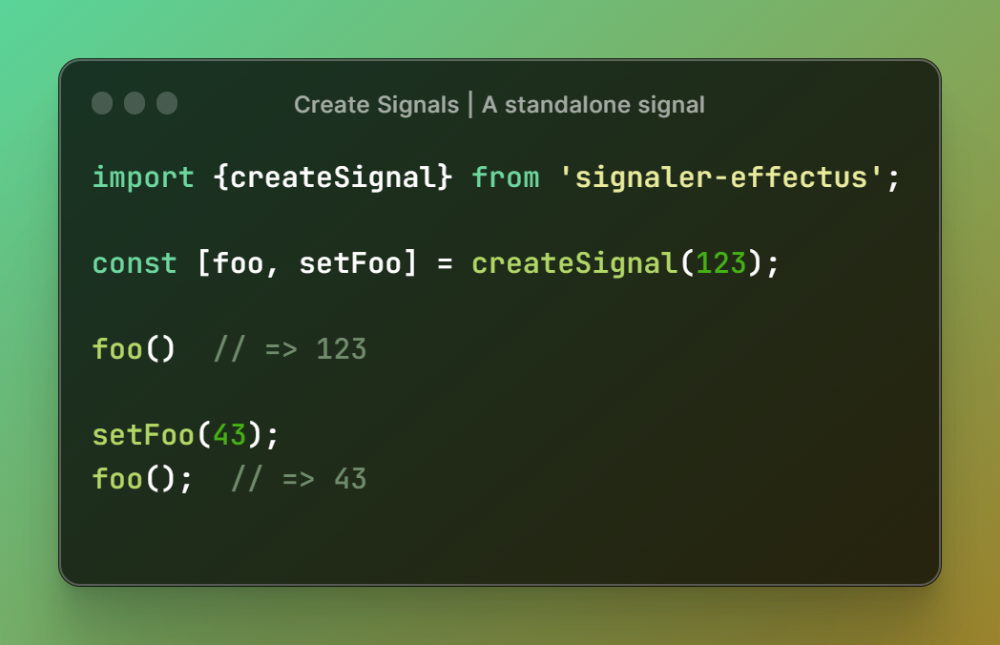
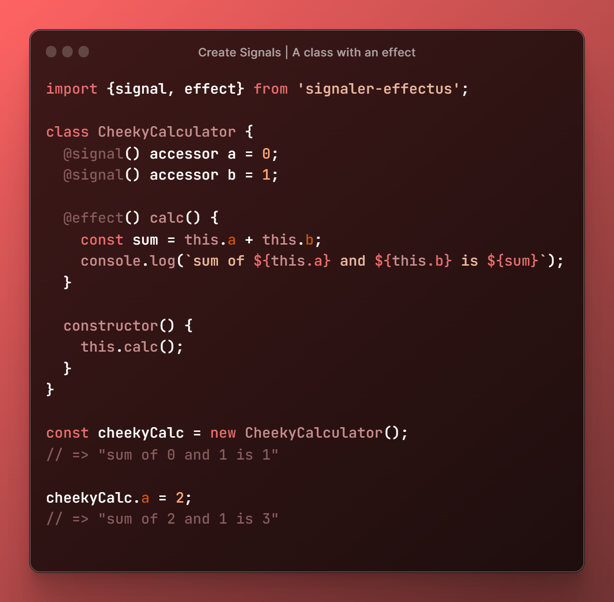
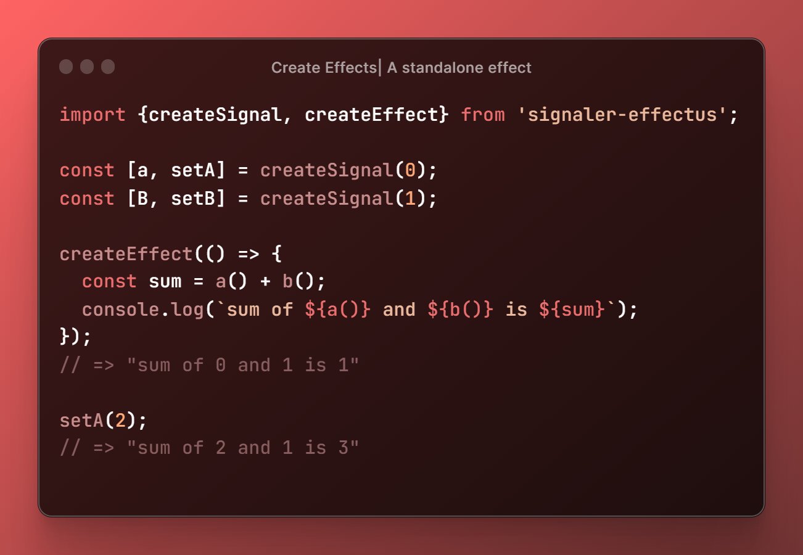

> NOTE: formerly known as `@spearwolf/signalize` this library is now in the process of renaming itself `signaler-effectus`. so when `signaler-effectus` is referred to in the following documentation, it is intentional and if `@spearwolf/signalize` is still used, it is probably deprecated and will be adapted in the future.

# signaler-effectus

The library for signals and effects on the web

## Create Signals

Signals are mutable states that can trigger effects when changed.

### A class with a signal

### A standalone signal

## Create Effects

Effects are functions that react to changes in signals and are executed automatically.

_Without_ effects, signals are nothing more than ordinary variables.

With effects, you can easily control behavior changes in your application without having to write complex dependency or monitoring logic.

### A class with an effect

_...TBD..._
