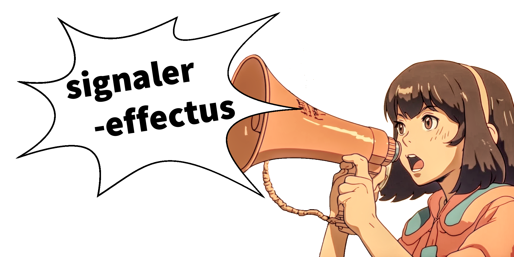

> The library for signals and effects on the web

_Signaler-effectus_ targets modern browsers and javascript based environments.
It is written in **Typescript v5** and uses the new [ecmascript decorators](https://github.com/tc39/proposal-decorators).

# Install

```shell
npm install signaler-effectus
```

`ESNext` is currently used as [typescript compile target](https://www.typescriptlang.org/tsconfig#target) (but that may change in the future).
To achieve interoperability with older javascript environments you might have to use an additional transpile pipeline of your own.

_Signaler-effectus_ is a standalone package with only one dependency [spearwolf/eventize](https://github.com/spearwolf/eventize) (which does not need any dependencies to other packages)

# Overview

The API of _signaler-effectus_ basically centers around these three main concepts:

- __signals__ &mdash; like state variables with hidden superpowers
- __effects__ &mdash; just think of it as a standalone `useEffect()` hook (but without react ;)
- __connections__ &mdash; which are basically links between signals and functions.. like the geometry node connections in blender or the node connections in blueprints of the unreal engine

A __functional api__ is provided, as well as a __class-based api that uses decorators__.

> :bangbang: You could think of signals as a kind of alternative callbacks/promises or as an event-based programming technique

Under the hood the event library [spearwolf/eventize](https://github.com/spearwolf/eventize) is used &rarr; In fact, *__signals__ and __events__ can complement each other very well*.

It has no dependencies on other packages and can therefore be used standalone or in addition to other frameworks (such as react, angular or _insert-your-favorite-framework-here_)


# Usage

## Create Signals

Signals are mutable states that can trigger effects when changed.

<table>
  <tbody>
    <tr>
      <th>A class with a signal</th>
      <th>A standalone signal</th>
    </tr>
    <tr>
      <td valign="top">
        <picture>
          <source media="(prefers-color-scheme: dark)" srcset="https://raw.githubusercontent.com/spearwolf/signalize/dev/docs/images/a_class_with_a_signal--dark.png">
          <source media="(prefers-color-scheme: light)" srcset="https://raw.githubusercontent.com/spearwolf/signalize/dev/docs/images/a_class_with_a_signal--light.png">
          
        </picture>
      </td>
      <td valign="top">
        <picture>
          <source media="(prefers-color-scheme: dark)" srcset="https://raw.githubusercontent.com/spearwolf/signalize/dev/docs/images/a_standalone_signal--dark.png">
          <source media="(prefers-color-scheme: light)" srcset="https://raw.githubusercontent.com/spearwolf/signalize/dev/docs/images/a_standalone_signal--light.png">
          
        </picture>
      </td>
    </tr>
  </tbody>
</table>


## Create Effects

Effects are functions that react to changes in signals and are executed automatically.

_Without_ effects, signals are nothing more than ordinary variables.

With effects, you can easily control behavior changes in your application without having to write complex dependency or monitoring logic.

<table>
  <tbody>
    <tr>
      <th>A class with an effect method</th>
      <th>A standalone effect function</th>
    </tr>
    <tr>
      <td valign="top">
        <picture>
          <source media="(prefers-color-scheme: dark)" srcset="https://raw.githubusercontent.com/spearwolf/signalize/dev/docs/images/a_class_with_an_effect_method--dark.png">
          <source media="(prefers-color-scheme: light)" srcset="https://raw.githubusercontent.com/spearwolf/signalize/dev/docs/images/a_class_with_an_effect_method--light.png">
          
        </picture>
      </td>
      <td valign="top">
        <picture>
          <source media="(prefers-color-scheme: dark)" srcset="https://raw.githubusercontent.com/spearwolf/signalize/dev/docs/images/a_standalone_effect_function--dark.png">
          <source media="(prefers-color-scheme: light)" srcset="https://raw.githubusercontent.com/spearwolf/signalize/dev/docs/images/a_standalone_effect_function--light.png">
          
        </picture>
      </td>
    </tr>
  </tbody>
</table>

Effects are always executed automatically immediately if a signal that is read out within the effect is changed afterwards.

Sometimes, however, this is a little more often than you actually need: If you change a and then b in the example above, the result will be announced by the effect each time. If you only want to get the final result after changing both signals, you can use the `batch(callback)` function. Within the batch callback, all signals are written, but the dependent effects are not executed until the end of the batch function:

<table>
  <tbody>
    <tr>
      <th></th>
      <th></th>
    </tr>
    <tr>
      <td valign="top">
        <picture>
          <source media="(prefers-color-scheme: dark)" srcset="https://raw.githubusercontent.com/spearwolf/signalize/dev/docs/images/signal_batch_object--dark.png">
          <source media="(prefers-color-scheme: light)" srcset="https://raw.githubusercontent.com/spearwolf/signalize/dev/docs/images/signal_batch_object--light.png">
          
        </picture>
      </td>
      <td valign="top">
        <picture>
          <source media="(prefers-color-scheme: dark)" srcset="https://raw.githubusercontent.com/spearwolf/signalize/dev/docs/images/signal_batch_func--dark.png">
          <source media="(prefers-color-scheme: light)" srcset="https://raw.githubusercontent.com/spearwolf/signalize/dev/docs/images/signal_batch_func--light.png">
          
        </picture>
      </td>
    </tr>
  </tbody>
</table>

See [The difference between the standard behavior of effects and the use of batching](./docs/AdvancedGuide.md#the-difference-between-the-standard-behavior-of-effects-and-the-use-of-batching) for more informations on this.


---


_...TBD..._

[see old README for more infos](./README-legacy.md)
