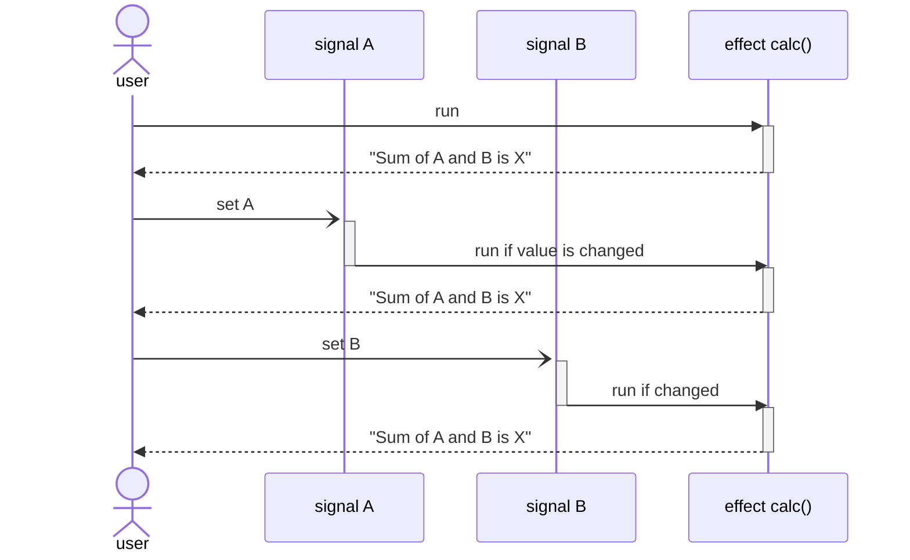
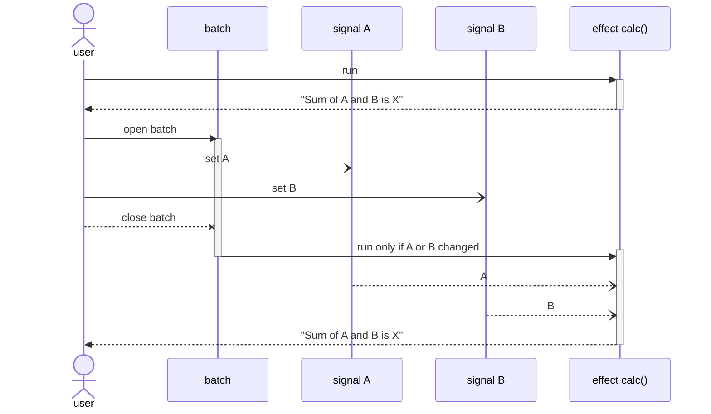

# signaler-effectus

## Advanced Guide/Documentation

## The difference between the standard behavior of effects and the use of batching

Suppose we have written a basic but cheeky calculator that prints the result of the expression `a + b` to the console as soon as a new result is available:


```ts
import { signal, effect } from 'signaler-effectus';

class CheekyCalculator {
	@signal() accessor a = 0;
	@signal() accessor b = 1;

	@effect() calc() {
		const sum = this.a + this.b;

		console.log(`Sum of ${thia.a} and ${this.b} is ${sum}`);
	}

	constructor() {
		this.calc();
	}
}

const cheekyCalc = new CheekyCalculator();
// => "Sum of 0 and 1 is 1"

```

### Run effect by updating signals

As soon as we change one of the signals, the new result is output immediately:

```ts
cheekyCalc.a = 1;
// => "Sum of 1 and 1 is 2"

cheekyCalc.b = 1;
// nothing happens here because b has been 1 before and so it is not a change

cheekyCalc.b = 2;
// => "Sum of 1 and 2 is 3"
```

In a sequence diagram it looks like this:



### Delay effect by batching

By _batching_ we can control this behavior.
Within a batch context, no effect is executed until the batch is closed.
This also applies to nested batches, of course.
After the batch, all affected effects will be called again - but of course only if their signals have changed!

```ts
import { batch } from 'signaler-effectus';

batch(() => {
	cheekyCalc.a = 1;
	cheekyCalc.b = 2;
})
// => "Sum of 1 and 2 is 3"
```

The sequence diagram looks different here:


